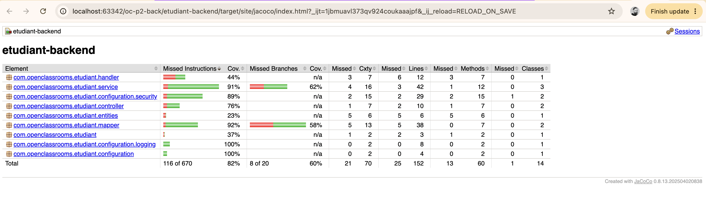
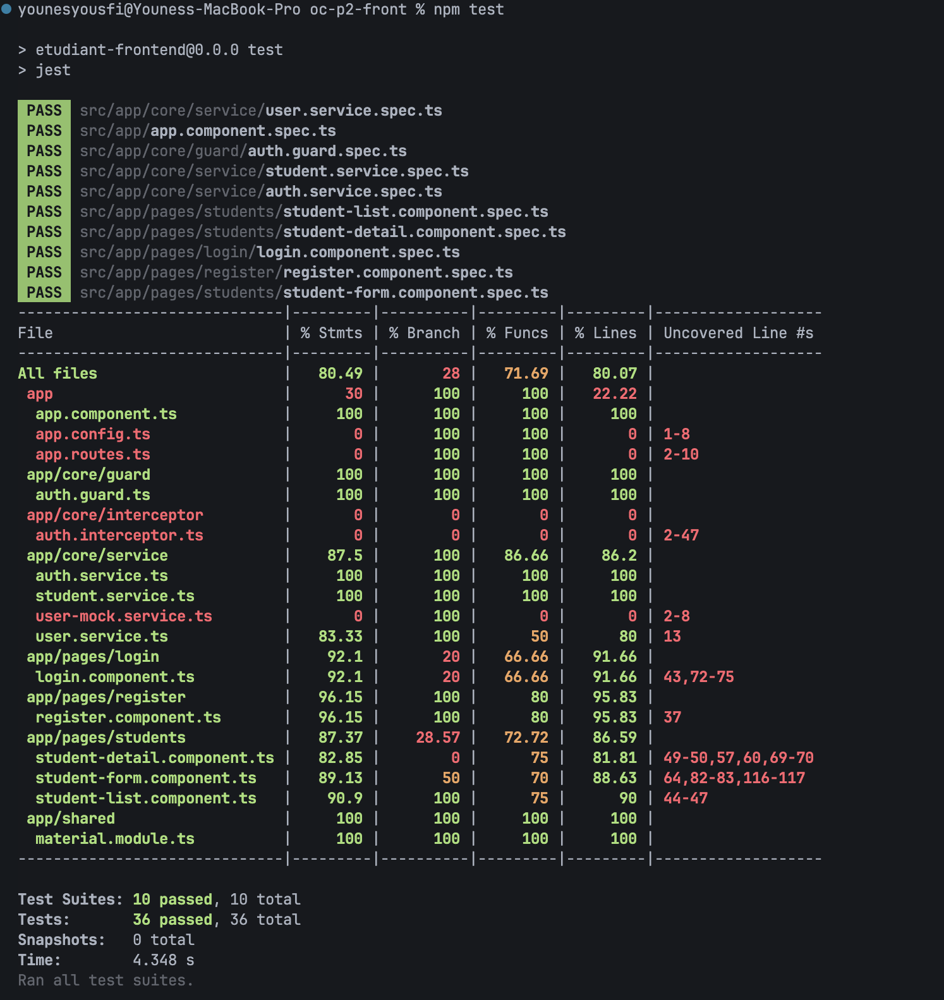
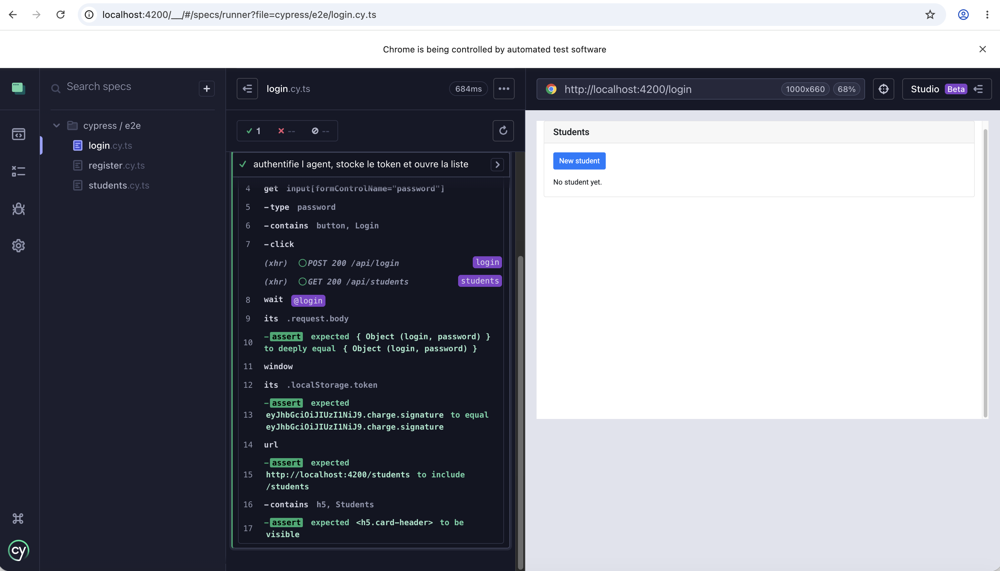
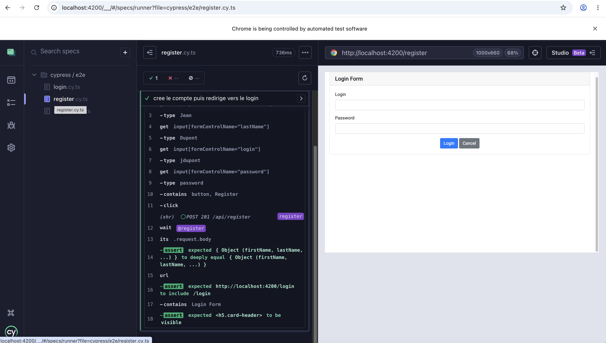
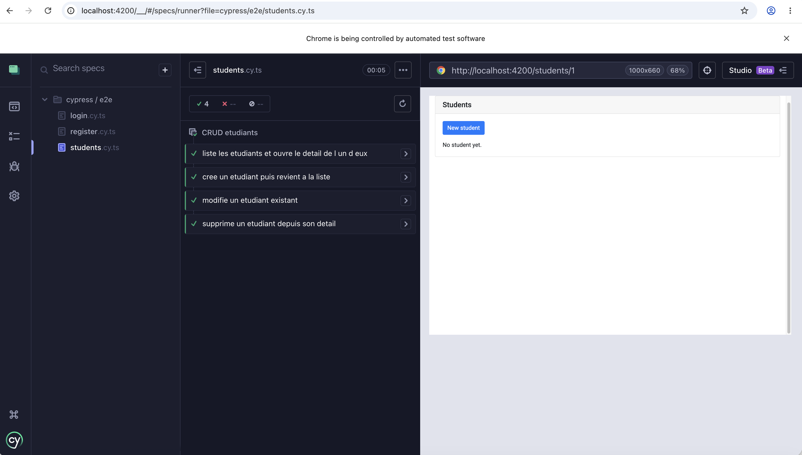

# Rapport de test:

## Back-end/Jacoco:




## Front-end/Jest:

```
younesyousfi@Youness-MacBook-Pro oc-p2-front % npm test   

> etudiant-frontend@0.0.0 test
> jest

 PASS  src/app/core/service/user.service.spec.ts
 PASS  src/app/app.component.spec.ts
 PASS  src/app/core/guard/auth.guard.spec.ts
 PASS  src/app/core/service/student.service.spec.ts
 PASS  src/app/core/service/auth.service.spec.ts
 PASS  src/app/pages/students/student-list.component.spec.ts
 PASS  src/app/pages/students/student-detail.component.spec.ts
 PASS  src/app/pages/login/login.component.spec.ts
 PASS  src/app/pages/register/register.component.spec.ts
 PASS  src/app/pages/students/student-form.component.spec.ts
------------------------------|---------|----------|---------|---------|-------------------
File                          | % Stmts | % Branch | % Funcs | % Lines | Uncovered Line #s 
------------------------------|---------|----------|---------|---------|-------------------
All files                     |   80.49 |       28 |   71.69 |   80.07 |                   
 app                          |      30 |      100 |     100 |   22.22 |                   
  app.component.ts            |     100 |      100 |     100 |     100 |                   
  app.config.ts               |       0 |      100 |     100 |       0 | 1-8               
  app.routes.ts               |       0 |      100 |     100 |       0 | 2-10              
 app/core/guard               |     100 |      100 |     100 |     100 |                   
  auth.guard.ts               |     100 |      100 |     100 |     100 |                   
 app/core/interceptor         |       0 |        0 |       0 |       0 |                   
  auth.interceptor.ts         |       0 |        0 |       0 |       0 | 2-47              
 app/core/service             |    87.5 |      100 |   86.66 |    86.2 |                   
  auth.service.ts             |     100 |      100 |     100 |     100 |                   
  student.service.ts          |     100 |      100 |     100 |     100 |                   
  user-mock.service.ts        |       0 |      100 |       0 |       0 | 2-8               
  user.service.ts             |   83.33 |      100 |      50 |      80 | 13                
 app/pages/login              |    92.1 |       20 |   66.66 |   91.66 |                   
  login.component.ts          |    92.1 |       20 |   66.66 |   91.66 | 43,72-75          
 app/pages/register           |   96.15 |      100 |      80 |   95.83 |                   
  register.component.ts       |   96.15 |      100 |      80 |   95.83 | 37                
 app/pages/students           |   87.37 |    28.57 |   72.72 |   86.59 |                   
  student-detail.component.ts |   82.85 |        0 |      75 |   81.81 | 49-50,57,60,69-70 
  student-form.component.ts   |   89.13 |       50 |      70 |   88.63 | 64,82-83,116-117  
  student-list.component.ts   |    90.9 |      100 |      75 |      90 | 44-47             
 app/shared                   |     100 |      100 |     100 |     100 |                   
  material.module.ts          |     100 |      100 |     100 |     100 |                   
------------------------------|---------|----------|---------|---------|-------------------

Test Suites: 10 passed, 10 total
Tests:       36 passed, 36 total
Snapshots:   0 total
Time:        4.348 s
Ran all test suites.
```



## e2e / Cypress:

```
younesyousfi@Youness-MacBook-Pro oc-p2-front % npx cypress run
npx cypress run

====================================================================================================

  (Run Starting)

  ┌────────────────────────────────────────────────────────────────────────────────────────────────┐
  │ Cypress:        16.1.0                                                                         │
  │ Browser:        Electron 146 (headless) (deprecated)                                           │
  │ Node Version:   v22.23.2 (/Users/younesyousfi/.local/share/fnm/node-versions/v22.23.2/installa │
  │                 tion/bin/node)                                                                 │
  │ Specs:          3 found (login.cy.ts, register.cy.ts, students.cy.ts)                          │
  │ Searched:       cypress/e2e/**/*.cy.{js,jsx,ts,tsx}                                            │
  └────────────────────────────────────────────────────────────────────────────────────────────────┘

Warning: The Electron browser is deprecated as a test browser and will be removed in a future version of Cypress.

Switch to Chrome or another installed browser to avoid a breaking change when you upgrade.

Read more about supported browsers: https://on.cypress.io/launching-browsers


────────────────────────────────────────────────────────────────────────────────────────────────────
                                                                                                    
  Running:  login.cy.ts                                                                     (1 of 3)


  Connexion d un agent
    ✓ authentifie l agent, stocke le token et ouvre la liste (847ms)


  1 passing (871ms)


  (Results)

  ┌────────────────────────────────────────────────────────────────────────────────────────────────┐
  │ Tests:        1                                                                                │
  │ Passing:      1                                                                                │
  │ Failing:      0                                                                                │
  │ Pending:      0                                                                                │
  │ Skipped:      0                                                                                │
  │ Screenshots:  0                                                                                │
  │ Video:        false                                                                            │
  │ Duration:     0 seconds                                                                        │
  │ Spec Ran:     login.cy.ts                                                                      │
  └────────────────────────────────────────────────────────────────────────────────────────────────┘


────────────────────────────────────────────────────────────────────────────────────────────────────
                                                                                                    
  Running:  register.cy.ts                                                                  (2 of 3)


  Inscription d un agent
    ✓ cree le compte puis redirige vers le login (884ms)


  1 passing (909ms)


  (Results)

  ┌────────────────────────────────────────────────────────────────────────────────────────────────┐
  │ Tests:        1                                                                                │
  │ Passing:      1                                                                                │
  │ Failing:      0                                                                                │
  │ Pending:      0                                                                                │
  │ Skipped:      0                                                                                │
  │ Screenshots:  0                                                                                │
  │ Video:        false                                                                            │
  │ Duration:     0 seconds                                                                        │
  │ Spec Ran:     register.cy.ts                                                                   │
  └────────────────────────────────────────────────────────────────────────────────────────────────┘


────────────────────────────────────────────────────────────────────────────────────────────────────
                                                                                                    
  Running:  students.cy.ts                                                                  (3 of 3)


  CRUD etudiants
    ✓ liste les etudiants et ouvre le detail de l un d eux (375ms)
    ✓ cree un etudiant puis revient a la liste (560ms)
    ✓ modifie un etudiant existant (533ms)
    ✓ supprime un etudiant depuis son detail (164ms)


  4 passing (2s)


  (Results)

  ┌────────────────────────────────────────────────────────────────────────────────────────────────┐
  │ Tests:        4                                                                                │
  │ Passing:      4                                                                                │
  │ Failing:      0                                                                                │
  │ Pending:      0                                                                                │
  │ Skipped:      0                                                                                │
  │ Screenshots:  0                                                                                │
  │ Video:        false                                                                            │
  │ Duration:     1 second                                                                         │
  │ Spec Ran:     students.cy.ts                                                                   │
  └────────────────────────────────────────────────────────────────────────────────────────────────┘


====================================================================================================

  (Run Finished)


       Spec                                              Tests  Passing  Failing  Pending  Skipped  
  ┌────────────────────────────────────────────────────────────────────────────────────────────────┐
  │ ✔  login.cy.ts                              872ms        1        1        -        -        - │
  ├────────────────────────────────────────────────────────────────────────────────────────────────┤
  │ ✔  register.cy.ts                           910ms        1        1        -        -        - │
  ├────────────────────────────────────────────────────────────────────────────────────────────────┤
  │ ✔  students.cy.ts                           00:01        4        4        -        -        - │
  └────────────────────────────────────────────────────────────────────────────────────────────────┘
    ✔  All specs passed!                        00:03        6        6        -        -        -  
```





